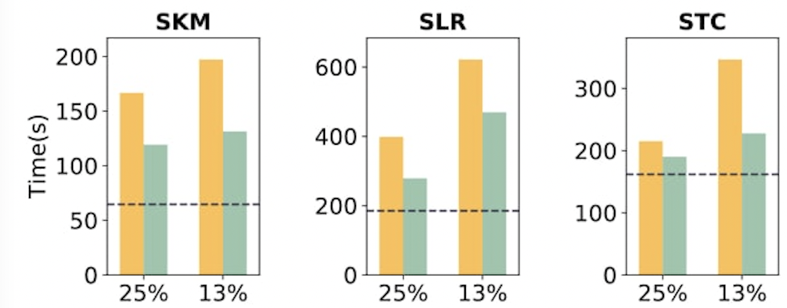

# MemLiner README

We prepared **four machines** (two CPU server - memory server pairs) with InfiniBand plugged in for artifact evaluation. The configuration of these four machines are not exactly the same as the servers we used in the paper, but you should be able to see similar speedups. 


**Warning**: please confirm that no other users are using the same pair of servers at the same time.  You can use command `w`  and `tmux ls` to check other logins. There should be no other users on the CPU server, and only a tmux session on the memory server, running as the RemoteSwap server. It is not recommended to use Remote-SSH of Visual Studio Code to log in to the servers as this kind of log-in is not detectable by others with `w`.

Expected output on the CPU server. If there is any user, make sure it is you.

```bash
# CPU server
guest@zion-1:~$ w
21:52:16 up 48 min,  1 user,  load average: 0.20, 0.86, 1.00
USER     TTY      FROM             LOGIN@   IDLE   JCPU   PCPU WHAT
guest    pts/0    164.67.229.133   21:52    0.00s  0.04s  0.00s w
```

Expected output on the memory server. If there is any user other than the tmux session running RemoteSwap server, make sure it is you.

```bash
# Memory server
guest@zion-4:~$ w
14:55:54 up 51 min,  2 users,  load average: 0.02, 0.09, 0.33
USER     TTY      FROM             LOGIN@   IDLE   JCPU   PCPU WHAT
guest    pts/5    tmux(5196).%0    14:11    1:30   0.10s  0.16s tmux
guest    pts/6    131.179.96.122   14:55    0.00s  0.08s  0.01s w

guest@zion-4:~$ tmux ls
0: 1 windows (created Tue May  3 14:11:50 2022) [209x30]

guest@zion-4:~$ tmux a
[Here you should see the RemoteSwap server running]
```

# 1. Configuration

MemLiner has been configured on our provided machines. You can execute the applications directly on these machines. If you want to build all the things from the scratch, please check **Section 3**.

## 1.1 Connect the CPU server with the memory server

**Warning**: The CPU server and the memory server only need to be connected once, and the connection will persist until reboot or memory server process is killed. Before trying to connect, check whether they are already connected. See Question#1 in FAQ for instructions. If it is connected, directly go to section 1.2.

Launch the memory server:

```bash
# Log into memory server, e.g., guest@zion-4.cs.ucla.edu or guest@zion-12.cs.ucla.edu

# Let memory server run in background
tmux

# Launch the memory server and wait the connection from CPU serever
cd ${HOME}/MemLiner/scripts/server
./rswap-server
```

Launch the CPU server:

```bash
# Log into the CPU server, e.g., guest@zion-1.cs.ucla.edu or guest@zion-3.cs.ucla.edu
cd ${HOME}/MemLiner/scripts/client
./manage_rswap_client.sh install

# Confirm the success of the RDMA connection between the CPU server and the memory server.
# Print the kernel log by:
dmesg | grep "frontswap module loaded"

# the output should be:
[Some timestamp] frontswap module loaded
```

## 1.2 Limit the memory resources of applications

MemLiner relies on *cgroup* to limit the memory usage of applications running on the CPU server. we are using cgroup version 1 here. 

Create cgroup on the CPU server:

```bash
# Create a memory cgroup, memctl, for the applications running on the CPU server.
# $USER is the username of the account. It's "guest" here.
sudo cgcreate -t $USER -a $USER -g memory:/memctl

# Please confirm that a memory cgroup directory is built as:
/sys/fs/cgroup/memory/memctl
```

Limit local memory size on the CPU server. E.g., set local memory to 9GB:

```bash
# Please adjust the local memory size for different applications.
# e.g., for Spark with a 32GB Java heap. 25% local memory ratio means that we limit its CPU server memory size to 9GB.
# Application's working set includeds both Java heap and off-heap data, which is around 36GB in total. 
echo 9g > /sys/fs/cgroup/memory/memctl/memory.limit_in_bytes
```

# 2. Run the applications

Here we take Apache Spark as an example to show how to run the applications on MemLiner. If users want to run other applications, please refer to **Section 4**. If users want to build all the components, e.g., Kernel, OpenJDK and drivers, from the scratch, please refer to **Section 3**.

## 2.1 All-in-one shell script

Assume users are on the provided servers, e.g., `guest@zion-1.cs.ucla.edu` (CPU server) and `guest@zion-4.cs.ucla.edu` (Memory server). You can use the provided all-in-one shell script: `${HOME}/MemLinerScripts/run-all.sh` to generate the results for both the MemLiner and the Baseline(default OpenJDK).

```bash
# switch to the directory
cd ${HOME}/MemLinerScripts

# launch tmux
tmux

# Run spark applicaions
# ./run-all.sh app_name
# app_name list: tradesoap spark, neo4j, cas, quickcached
./run-all.sh spark

# All the results are in 
${HOME}/MemLinerTimeLogs/evaluation51-ae.pdf
```

The results in evaluation_51.pdf shown as:



## 2.2 Run the applications step-by-step

The steps  below generate the same results with the all-in-one script. Here still takes Apache Spark as an example to show how to execute it on the MemLiner.

### 2.3.1 Configuration

Assume the users are on the CPU server, e.g., `guest@zion-1.cs.ucla.edu` . Choose the corresponding configuration files for Spark.  Assume we are going to run the Spark on MemLiner.

```bash
# Go to the Spark config directories
cd  ${HOME}/spark-3.0.0-preview2-bin-hadoop3.2/conf

# Copy the configuration of MemLiner to override the spark-defaults.conf
cp ${HOME}/MemLinerScripts/config-files/spark-confs/spark-defaults-memliner.conf  spark-defaults.conf
```

### 2.3.2 Start the Spark Master and Worker services

```bash
# Run the start-all.sh 
# In our configured servers, the launched Worker will be added into the created cgroup automatically.
${HOME}/spark-3.0.0-preview2-bin-hadoop3.2/sbin/start-all.sh

# Confirm that both Spark master and worker are running in the backgroud
jps
# Shown as, <PID, Service_name>
# For example:
# 23639 Master
# 23852 Worker
```

### 2.3.3 Run Spark applications

Choose the Spark application name and local memory ratio, e.g., 25% or 13%, and then execute the applications:

```bash
# Two Parameters:
# Para#1 application: lr, km, tc
# Para#2 mem_local_ratio: 25, 13
${HOME}/MemLinerScripts/app-scripts/scripts/memliner.sh ${application} ${mem_local_ratio} 
```

Switch the configuration to **spark-defaults-baseline.conf** and redo the steps to run Spark on the baseline platform.

# 3. Build & Install MemLiner

## 3.1 Environments

Two sets of environment have been tested for MemLiner:

```bash
Ubuntu 18.04
Linux 5.4
OpenJDK 12.04
GCC 5.5 
MLNX_OFED driver 4.9-2.2.4.0

or

CentOS 7.5 - 7.7
Linux 5.4
OpenJDK 12.04
GCC 5.5
MLNX_OFED driver 4.9-2.2.4.0 
```

Among the requirements, the Linux version, OpenJDK version and MLNX-OFED driver version are guaranteed during the build & installation process below. Just make sure that the Linux distribution version and gcc version are correct.

## 3.2 Install Kernel

Next we will use Ubuntu 18.04 as an example to show how to build and install the kernel. Please change the kernel on both CPU and memory server.

（1）Change the grub parameters

```bash
sudo vim /etc/default/grub

# Choose the bootup kernel version as 5.4.0
GRUB_DEFAULT="Advanced options for Ubuntu>Ubuntu, with Linux 5.4.0"

# Change the value of GRUB_CMDLINE_LINUX:
GRUB_CMDLINE_LINUX="nokaslr transparent_hugepage=madvise intel_pstate=disable idle=poll processor.max_cstate=0 intel_idle.max_cstate=0"

```

（2）Build the Kernel source code && install it. In case new kernel options are prompted during `sudo ./build_kernel.sh build`, press enter to use the default options.

```bash
# Change to the kernel folder:
cd MemLiner/Kernel

# In case new kernel options are prompted, press enter to use the default options.
sudo ./build_kernel.sh build
sudo ./build_kernel.sh install
sudo reboot
```

## 3.3 Install MLNX OFED Driver

**Preparations:**

MemLiner is only tested on `MLNX_OFED-4.9-2.2.4.0`. Download and unzip the package according to your system version, on both CPU and memory server.

Take Ubuntu 18.04 as an example:

### 3.3.1 Download & Install the MLNX_OFED driver

```bash
# Download the MLNX OFED driver for the Ubuntu 18.04
wget https://content.mellanox.com/ofed/MLNX_OFED-4.9-2.2.4.0/MLNX_OFED_LINUX-4.9-2.2.4.0-ubuntu18.04-x86_64.tgz
tar xzf MLNX_OFED_LINUX-4.9-2.2.4.0-ubuntu18.04-x86_64.tgz
cd MLNX_OFED_LINUX-4.9-2.2.4.0-ubuntu18.04-x86_64

# Remove the incompatible libraries
sudo apt remove ibverbs-providers:amd64 librdmacm1:amd64 librdmacm-dev:amd64 libibverbs-dev:amd64 libopensm5a libosmvendor4 libosmcomp3 -y

# Install the MLNX OFED driver against the kernel 5.4.0
sudo ./mlnxofedinstall --add-kernel-support
```

### 3.3.2 Enable the *opensm* and *openibd* services

(1) Enable and start the ***openibd*** service

```bash
sudo systemctl enable openibd
sudo systemctl start  openibd

# confirm the service is running and enabled:
sudo systemctl status openibd

# the log shown as:
● openibd.service - openibd - configure Mellanox devices
   Loaded: loaded (/lib/systemd/system/openibd.service; enabled; vendor preset: enabled)
   Active: active (exited) since Mon 2022-05-02 14:40:53 CST; 1min 24s ago
    
```

(2) Enable and start the ***opensmd*** service:

```bash
sudo systemctl enable opensmd
sudo systemctl start opensmd

# confirm the service status
sudo systemctl status opensmd

# the log shown as:
opensmd.service - LSB: Manage OpenSM
   Loaded: loaded (/etc/init.d/opensmd; generated)
   Active: active (running) since Mon 2022-05-02 14:53:39 CST; 10s ago

#
# Warning: you may encounter the problem:
#
opensmd.service is not a native service, redirecting to systemd-sysv-install.
Executing: /lib/systemd/systemd-sysv-install enable opensmd
update-rc.d: error: no runlevel symlinks to modify, aborting!

#
# Please refer to the **Question #2** in FAQ for how to solve this problem
#
```

### 3.3.3 Confirm the InfiniBand is available

Check the InfiniBand information

```bash
# Get the InfiniBand information
ibstat

# the log shown as:
# Adapter's stat should be Active.

	Port 1:
		State: Active
		Physical state: LinkUp
		Rate: 100
		Base lid: 3
		LMC: 0
		SM lid: 3
		Capability mask: 0x2651e84a
		Port GUID: 0x0c42a10300605e88
		Link layer: InfiniBand
```

### 3.3.4 For other OS distributions

### (1) CentOS 7.7

Install the necessary libraries

```bash
sudo yum install -y gtk2 atk cairo tcl tk
```

Download the MLNX OFED driver for CentOS 7.7

```bash
wget https://content.mellanox.com/ofed/MLNX_OFED-4.9-2.2.4.0/MLNX_OFED_LINUX-4.9-2.2.4.0-rhel7.7-x86_64.tgz
```

And then, repeat the steps from 3.3.1 to 3.3.3.

## 3.4 Build the RemoteSwap data path

The user needs to build the RemoteSwap on both the CPU server and memory servers.

### 3.4.1  Configuration

(1) IP configuration

Assign memory server’s ip address to both the CPU server and memory servers. Take `guest@zion-1.cs.ucla.edu`(CPU server) and `guest@zion-4.cs.ucla.edu`(Memory server) as an example. Memory server’s InfiniBand IP address is 10.0.0.4: (InfiniBand IP of zion-12 is 10.0.0.12. IPs of IB on other servers can be printed with `ifconfig ib0 | grep inet`)

```cpp
// (1) CPU server
// Replace the ${HOME}/Memliner/scripts/client/rswap_rdma.c:783:	char ip[] = "memory.server.ib.ip";
// to:
char ip[] = "10.0.0.4";

// (2) Memory server
// Replace the ${HOME}/Memliner/scripts/server/rswap_server.cpp:61:	const char *ip_str = "memory.server.ib.ip";
// to:
const char *ip_str = "10.0.0.4";
```

(2) Available cores configuration for RemoteSwap server (memory server).

Replace the macro, `ONLINE_CORES`, defined in `MemLiner/scripts/server/rswap_server.hpp` to the number of cores of the CPU server (which can be printed by command line, `nproc` , on the CPU server.)

```cpp
// ${HOME}/MemLiner/scripts/server/rswap_server.hpp:38:
#define ONLINE_CORES 16
```

### 3.4.2 Build the RemoteSwap datapath

(1) Build the client end on the CPU server, e.g., `guest@zion-1.cs.ucla.edu`

```bash
cd ${HOME}/MemLiner/scripts/client
make clean && make
```

(2) Build the server end on the memory server, e.g., `guest@zion-4.cs.ucla.edu`

```bash
cd ${HOME}/MemLiner/scripts/server
make clean && make
```

And then, please refer to **Section 1.1** for how to connect the CPU server and the memory server.

## 3.5 Build MemLiner (OpenJDK) on CPU server

Build MemLiner JDK. Please download and install jdk-12.0.2 and other dependent libraries to build the MemLiner (OpenJDK)

```bash
cd ${HOME}/MemLiner/JDK
./configure --with-boot-jdk=$HOME/jdk-12.0.2 --with-debug-level=release
make JOBS=32
```

# 4.  Run other applications

We list how to run the other applications in this section: (1) Graph database, Neo4j; (2) Online stock trading emulating system, DayTrader (Tradesoap); (3) NoSQL database Cassandra; (4) In-memory key-value store QuickCached.

Here we show how to run the applications on MemLiner. Please follow the instructions listed in **Section 1** to prepare the CPU server and the memory server first.

## 4.1 Neo4J

A graph data base. We assume the users execute the applications on a pair of connected CPU-Memory servers, e.g., `guest@zion-1.cs.ucla.edu` and `guest@zion-4.cs.ucla.edu` .  The application is in the folder,  `${HOME}/neo4j`.

### 4.1.1 All-in-one shell script

```bash
# switch to the directory
cd ${HOME}/MemLiner/MemLinerScripts

# launch tmux
tmux

# Run spark applicaions
# ./run-all.sh app_name
# app_name list: tradesoap spark, neo4j, cas, quickcached
#
./run-all.sh neo4j

# The generated results are under:
${HOME}/MemLinerTimeLogs/evaluation51-ae.pdf
```

### 4.1.2 Run Neo4j step-by-step

### (1）Configuration

Assume we are going to run the applications on MemLiner. All the following operations are done on CPU server, e.g., `guest@zion-1.cs.ucla.edu`.

Change configurations of *Neo4j*  on CPU server:

```bash
# (1) the configurations of Neo4j is under /etc/neo4j/
cp ${HOME}/MemLinerScripts/config-files/neo4j-confs/neo4j-memliner.conf /etc/neo4j/neo4j.conf

# (2) Choose the correct Java version
sudo update-alternatives --set java ${HOME}/jdk12u-dev/build/linux-x86_64-server-release/jdk/bin/java
# Warning : please remember to switch the Java version back to the default jdk-12.0.2 after the execution. 
# Or it will affect the execution of other applications and users.
```

### (2) Launch the Neo4j server

Start Neo4J service in backgound. Wait until the log `INFO Started.` is printed before running the apps.

```bash
cd ${HOME}/MemLinerScripts/app-scripts
# Two parameters
# Para#1 mode: baseline, memliner
# Para#2 mem_local_ratio: 100, 25, 13
./start-neo4j.sh ${mode} ${mem_local_ratio}

#
# After started, the log shown as:
INFO Started
```

### (3) Execute the Neo4j applications

Change to the neo4j folder:

```bash
cd ${HOME}/neo4j
```

Execute the applications: (The cypher scripts are put under `${HOME}/neo4j/Neo4j`)

(1) Neo4J PageRank

```python
(time -p (cypher-shell -u neo4j -p neo4j -f Neo4j/apoc_batch_pagerank_stats.cypher) 2>&1) | tee -a logs/npr.log
```

(2) Neo4J Triangle Counting

```python
(time -p (cypher-shell -u neo4j -p neo4j -f Neo4j/apoc_batch_triangle_count_stats.cypher) 2>&1) | tee -a logs/ntc.log
```

(3) Neo4J Degree Centrality

```python
(time -p (cypher-shell -u neo4j -p neo4j -f Neo4j/apoc_batch_degree_centrality_stats_mutate.cypher) 2>&1) | tee -a logs/ndc.log
```

Use `ctrl+C` Stop the Neo4j server after running each application and repeat from step 2.1.4 (restart the Neo4j server).

## 4.2  TradeSoap

Assume we are on the CPU server, e.g., `guest@zion-1.cs.ucla.edu`.  ****The application is in the folder,  `${HOME}/tradesoap`.

### 4.2.1 All-in-one shell script

```bash
# switch to the directory
cd ${HOME}/MemLiner/MemLinerScripts

# launch tmux
tmux

# Run tradesoap applicaions
# ./run-all.sh app_name
# app_name list: tradesoap spark, neo4j, cassandra, quickcached
#
./run-all.sh tradesoap

# The generated results are under:
${HOME}/MemLinerTimeLogs/evaluation51-ae.pdf
```

### 4.2.2 Run TradeSoap step-by-step

### (1) Configuration

Please confirm that CPU server is connected to the memory server by following the instructions listed in **Section 1**.

### (2) Execute TradeSoap on MemLiner

```bash
# Para mode : baseline memlienr
# Para mem_local_ratio: 25, 13
${HOME}/tradesoap/run_tradesoap.sh ${mode} ${mem_local_ratio}
```

### (3)Known problems:

You might encounter AxisFault error when running baseline or MemLiner. You can just ignore it because that’s a confirmed bug in tradesoap implementation.

## 4.3  Cassandra

Assume we are on the CPU server, e.g., `guest@zion-1.cs.ucla.edu`. The application is in the folder: `${HOME}/cassandra`

### 4.3.1 All-in-one shell script

```bash
# switch to the directory
cd ${HOME}/MemLiner/MemLinerScripts

# launch tmux
tmux

# Run spark applicaions
# ./run-all.sh app_name
# app_name list: tradesoap spark, neo4j, cas, quickcached
#
./run-all.sh cas

# The generated results are under:
${HOME}/MemLinerTimeLogs/evaluation51-ae.pdf
```

### 4.3.2 Run Cassandra step-by-step

### (1) Configuration

Choose the corresponding configurations:

```bash
# (1) Choose the MemLiner version execution shell script
cp ${HOME}/MemLinerScripts/config-files/cassandra-confs/cassandra-memliner  ${HOME}/cassandra/bin/cassanra
# (2) Choose the MemLiner version JVM options 
cp ${HOME}/MemLinerScripts/config-files/cassandra-confs/jvm11-server-memliner.options ${HOME}/cassandra/conf/jvm11-server.options
```

### (2) Launch the Cassandra server (on the CPU server)

```bash
# Launch the Cassandra server on the CPU server, e.g., gueset@zion-1
# two parameter 
# Para#1 mode : memliner, baseline
# Para#2 mem_local_ratio : 25, 13
${HOME}/cassandra/scripts/start-cassandra.sh ${mode} ${mem_local_ratio} 
```

### (3) Run the applications (on the memory server)

Warning: the memory server, e.g., `guest@zion-4.cs.ucla.edu` is used as the Cassandra client. So, users need to log into the memory server to execute the shell script.

```bash
# On memory server, e.g., guest@zion-4
# three parameters
# Para#1 mode: memliner, baseline
# Para#2 workload: UI, RI, II
# Para#3 mem_local_ratio: 25, 13
cd ${HOME}/scripts-repo/cassandra/run_workload.sh ${mode} ${workload} ${mem_local_ratio}
```

## 4.4  QuickCached

Assume we are on the CPU server, e.g., `guest@zion-1.cs.ucla.edu`. The application is put in folder: `${HOME}/quickcached`

### 4.4.1 All-in-one shell script

```bash
# switch to the directory
cd ${HOME}/MemLiner/MemLinerScripts

# launch tmux
tmux

# Run spark applicaions
# ./run-all.sh app_name
# app_name list: tradesoap spark, neo4j, cassandra, quickcached
#
./run-all.sh quickcached

# The generated results are under:
${HOME}/MemLinerTimeLogs/evaluation51-ae.pdf
```

### 4.4.2 Run QuickCached step-by-step

```bash
# (1) On the CPU server, guest@zion-1.cs.ucla.edu
cd ${HOME}/quickcached

# start quickcached server
# Para#1 tool: baseline, memliner
# Para#2 mem_local_ratio: 100, 25, 13
# Para#3 app: qwd, qrd
./qcd.sh ${tool} ${mem_local_ratio} ${app}
# e.g., run QWD with baseline JVM under 25% local cache ratio
./qcd.sh baseline 25 qwd

# (2) On the memory server,  guest@zion-4.cs.ucla.edu
cd ${HOME}/scripts-repo/memcached

# run QWD. and write log to ~/logs-qc/${logfile}.log
./ycsb-memcached-helper.sh memliner-quickcached-writedominant ${logfile}
# run QRD. and write log to ~/logs-qc/${logfile}.log
./ycsb-memcached-helper.sh memliner-quickcached-readdominant  ${logfile}

# (3) Stop the backend services, on the CPU server,  guest@zion-1.cs.ucla.edu
## use ctrl+C to kill Quickcached server
```

# 5. Results Visualization

To visualize the results, first we need to collect the execution time of applications and fill them in a few `.csv` files. Then use a script to draw the figure.

### 5.1 Collect Execution Time

For Spark applications, when each application is run to the end on Zion-1, you can see the execution time formatted as below:

```
22/03/09 13:18:07 INFO ShutdownHookManager: Deleting directory ...
real 393.86
user 37.71
sys 2.79
```

The number after `real` is the execution time of the spark application, in seconds.

For Neo4j apps, find the log files under the logs folder in the command on Zion-1. And like Spark, in the end of the log file or stdout, the number after `real` is the execution time of the spark application, in seconds.

For Cassandra applications, on the ycsb client on Zion-4, under `/mnt/ssd/guest/scripts-repo/cassandra/logs`, you can find all the logs when running Cassandra apps. Select the run log, and you can see the run time of the app at the bottom of the file, as below:

```
2022-04-12 12:53:48:413 335 sec: 10000000 operations; ...
[OVERALL], RunTime(ms), 335107
[OVERALL], Throughput(ops/sec), 29841.214895540827
[TOTAL_GCS_G1_Young_Generation], Count, 8
```

The number after `[OVERALL], RunTime(ms),` is the execution time, in milliseconds.

The same information is printed in stdout when running the apps.

For Quickcached apps, the method is the same as Cassandra, except that the log folder is `/mnt/ssd/guest/logs-qc` on Zion-4.

For TradeSoap, after the application is finished on Zion-1, you can see the time as the output.

### 5.2 Generate the Plot.

On Zion-1. please change to this directory: `/mnt/ssd/guest/scripts-repo/projects/MemLiner/figures`, where you can find all data files and the plot script. First, fill in the execution time data (in seconds), to the three data file: `ae_baseline_time.csv`, `ae_memliner_time.csv`, and `ae_all_local_time.csv`. The order of data is denoted by the first row and the first column of the files. Then, run the script:

```
cd /mnt/ssd/guest/scripts-repo/projects/MemLiner/figures
python3 memliner_eval_ae.py
```

The figure should appear under the same directory named `evaluation51-ae.pdf`.

# FAQ

## Question#1 Confirm the connection status of the CPU server and the memory server

Step 1: ensure that connection is already established.

```bash
# On CPU server
# Check RDMA connection between the CPU server and the memory server.
# search for connection built log by:
dmesg | grep "frontswap module loaded"

# If the output is:
[Some timestamp] frontswap module loaded
# Then the connection has been established.
```

If there is no connection, connect according to instructions on section 1.1.

Step 2: ensure that connection is still working.

**Warning**: Press `ctrl+b`, then press `d` to leave a tmux session. Don’t kill the process running.

```bash
# On memory server
# try attaching all tmux sessions. E.g., attach to the most recent session
tmux a

# If a command is still running and there's output like below, the connection is still active.
[...]
handle_cqe, 2-sided RDMA message sent done ?
handle_cqe, REQUEST_CHUNKS, Send available Regions to CPU server.
send_regions , Send registered Java heap to CPU server, 12 chunks.
send_message, message size = 248
handle_cqe, 2-sided RDMA message sent done ?
```

If the connection is not active, reboot both servers. After the reboot, connect according to instructions on section 1.1.

## Question#2  Enable *opensmd* service in Ubuntu 18.04

### Error message:

```bash
opensmd.service is not a native service, redirecting to systemd-sysv-install.
Executing: /lib/systemd/systemd-sysv-install enable opensmd
update-rc.d: error: no runlevel symlinks to modify, aborting!
```

### 2.1 Update the service start level in /etc/init.d/opensmd

The original /etc/init.d/opensmd 

```bash
  8 ### BEGIN INIT INFO
  9 # Provides: opensm
 10 # Required-Start: $syslog openibd
 11 # Required-Stop: $syslog openibd
 12 # Default-Start: null
 13 # Default-Stop: 0 1 6
 14 # Description:  Manage OpenSM
 15 ### END INIT INFO
```

Change the content in the line `Default-start` /etc/init.d/opensmd to :

```bash
12 # Default-Start: 2 3 4 5
```

### 2.2 Enable && Start the *opensmd* service

```bash
# Enable and strart the opensmd service
sudo update-rc.d opensmd remove -f
sudo systemctl enable opensmd
sudo systemctl start opensmd

# confirm the service status
sudo systemctl status opensmd

# The log shown as:
opensmd.service - LSB: Manage OpenSM
   Loaded: loaded (/etc/init.d/opensmd; generated)
   Active: active (running) since Mon 2022-05-02 14:53:39 CST; 10s ago
    
```
